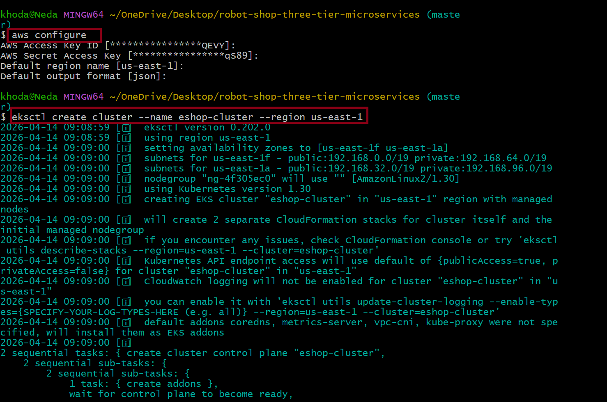
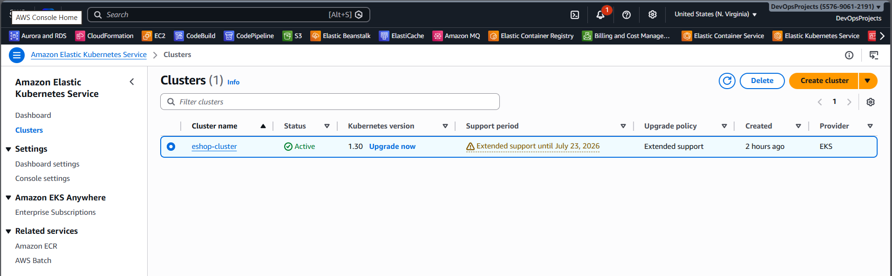
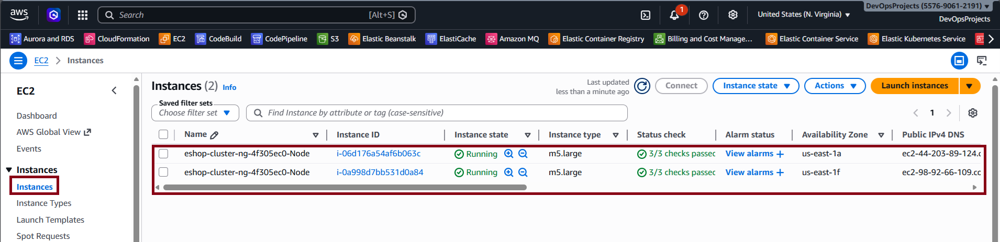

# Install EKS

Please follow the prerequisites doc before this.

## Install using Fargate

```
eksctl create cluster --name demo-cluster-three-tier-1 --region us-east-1
```
## Step 1: Create EKS Cluster



## Step 2: Verify Cluster



## Step 3: Worker Nodes



## Delete the cluster

```
eksctl delete cluster --name demo-cluster-three-tier-1 --region us-east-1
```


