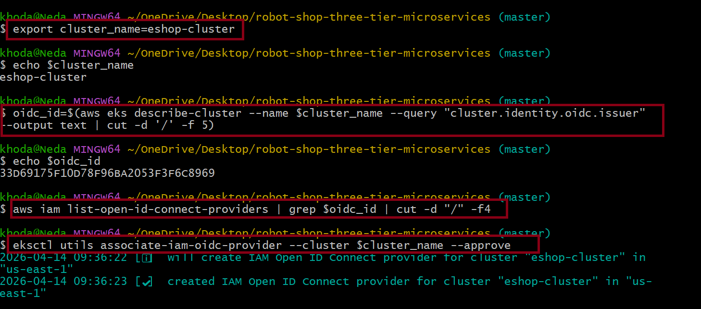

# commands to configure IAM OIDC provider 

```
export cluster_name=<CLUSTER-NAME>
```

```
oidc_id=$(aws eks describe-cluster --name $cluster_name --query "cluster.identity.oidc.issuer" --output text | cut -d '/' -f 5) 
```
## Step 4: Configure IAM OIDC Provider



```
aws iam list-open-id-connect-providers | grep $oidc_id | cut -d "/" -f4
```

If not, run the below command

```
eksctl utils associate-iam-oidc-provider --cluster $cluster_name --approve
```
